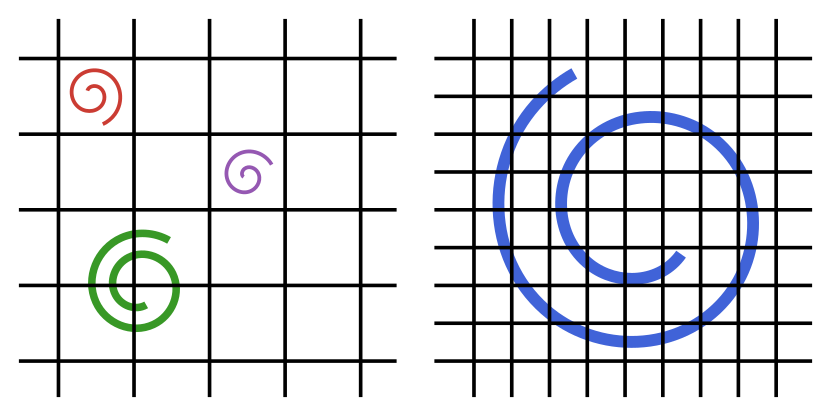

```@meta
CurrentModule = IncompressibleNavierStokes
```

# Large eddy simulation

Depending on the problem specification, a given grid resolution may not be
sufficient to resolve all spatial features of the flow. Consider the following
example:



On the left, the grid spacing is too large to capt the smallest eddies in the
flow. These eddies create sub-grid stresses that also affect the large scale
features. The grid must be refined if we want to compute these stresses
exactly.

On the right, the smallest spatial feature of the flow is fully resolved, and
there are no sub-grid stresses. The equations can be solved without worrying
about errors from unresolved features. This is known as *Direct Numerical
Simulation* (DNS).

If refining the grid is too costly, a closure model can be used to predict the
sub-grid stresses. The models only give an estimate for these stresses, and may
need to be calibrated to the given problem. When used correctly, they can
predict the evolution of the large fluid motions without computing the sub-grid
motions themselves. This is known as *Large Eddy Simulation* (LES).

Eddy viscosity models add a local contribution to the global baseline
viscosity. The baseline viscosity models transfer of energy from resolved to
atomic scales. The new turbulent viscosity on the other hand, models energy
transfer from resolved to unresolved scales. This non-constant field is
computed from the local velocity field.

```@docs
smagtensor!
smagorinsky_closure
```
